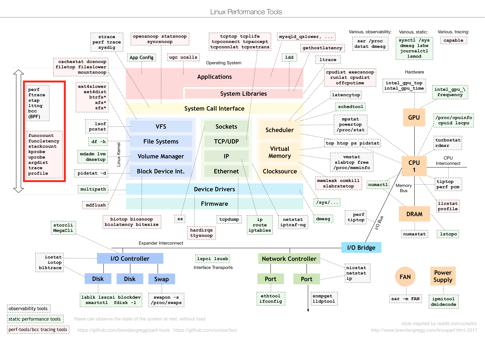
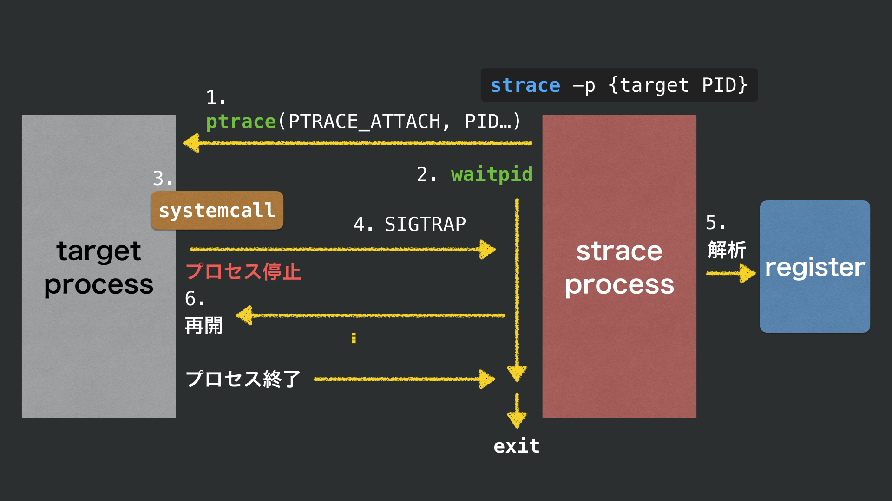
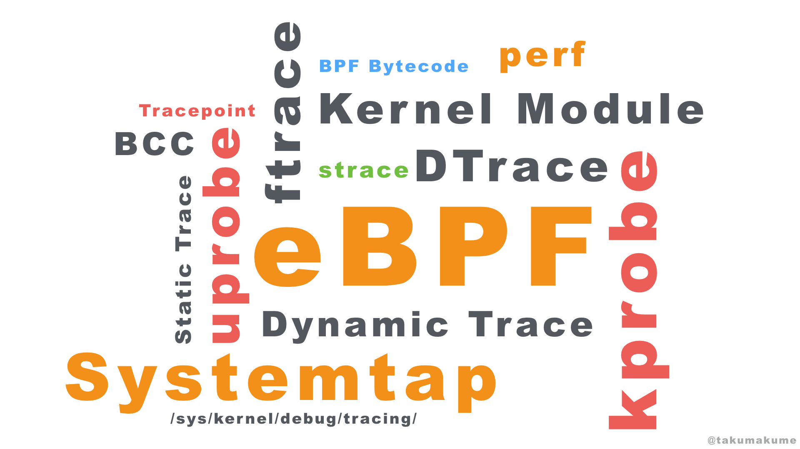
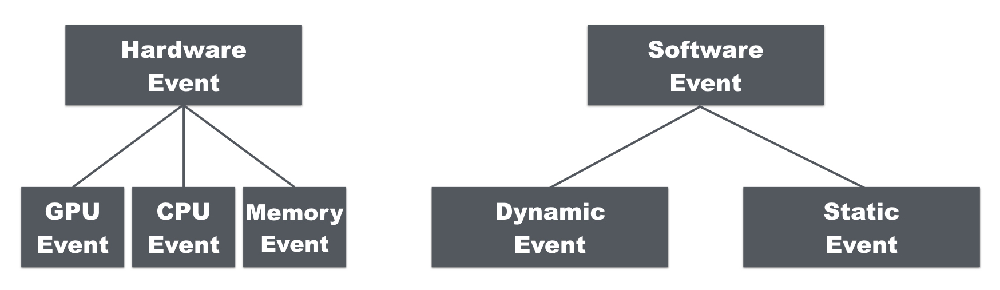
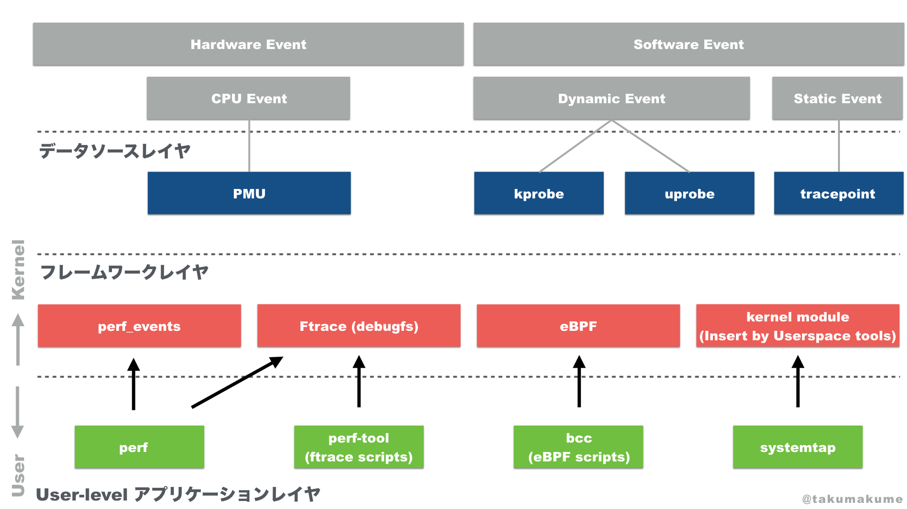

# Linuxのトレースツールの体系化

## 目次

<!-- MarkdownTOC -->

- [1.はじめに](#1.はじめに)
- [2.トレース手法の整理](#2.トレース手法の整理)
  - [2.1.イベントの分類](#2.1.イベントの分類)
  - [2.2.ツールの分類](#2.2.ツールの分類)
- [3.トレース手法の仕組み](#3.トレース手法の仕組み)
  - [3.1.データソース](#3.1.データソース)
    - [PMU (Performance Monitoring Units)](#PMU (Performance Monitoring Units))
    - [kprobe/uprobe](#kprobe/uprobe)
    - [tracepoint](#tracepoint)
  - [3.2.フレームワーク](#3.2.フレームワーク)
    - [Ftrace](#Ftrace)
    - [perf_events](#perf_events)
    - [eBPF](#eBPF)
  - [3.3.ツール](#3.3.ツール)
    - [perf](#perf)
    - [BCC (BPF Compiler Collection)](#BCC (BPF Compiler Collection))
    - [Systemtap](#Systemtap)
  - [3.4.トレースツールの歴史](#3.4.トレースツールの歴史)
- [4.おわりに](#4.おわりに)

<!-- /MarkdownTOC -->

## 1.はじめに

筆者が所属する、GMOペパボのホスティングサービスでお客様に貸し出しているLinuxのWebサーバの運用・開発において以下のような課題がある。

- 原因特定ができない高負荷が発生する。
- 原因特定ができないサーバダウン、プロセスダウンが発生する。
- 現在のボトルネックが厳密に把握できていないためパフォーマンスチューニング施策を打てない。

ホスティングはサービスの特性上、お客様が自由にプログラムを実行できる環境にあり、実行されるプログラムの種類は多種多様である。
また、共有サーバとして安価に提供しており1台のサーバを多くの人が利用するほどコストを抑えることができる。
その状況下で、障害の原因特定や、多種多様のプログラムを効率よく高速に実行できるようにすることは非常に重要なポイントだと考える。

我々は、サーバを安定稼働させるための情報としてサーバのCPUやメモリ、ログ、サービスレスポンスタイムなどを収集している。
冒頭に述べたような課題について、現在収集している情報では原因の特定に至ることができない場合がある。

例えば、高負荷などの障害が発生した時にリアルタイムに `top` や `ps` といったコマンドでどのプロセスが原因なのかが特定できることがあり、 `strace` でシステムコールのトレースや `lsof` によるプロセスがOpenしているファイルを確認することで原因を特定できる場合がある。特定できない場合に、やむおえずプロセスの再起動を実施することでなんとなく解決する場合などもある。

サーバの障害の予防や原因の特定の情報としてシステムコールのトレースなどが有効に活用することができたが、原因不明で終わってしまうこともしばしば発生する。原因の所在を特定するためにUser-levelのみのトレースではなくkernelレベルのトレース情報も活用することで現状から打開する策を検討したいと考える。

例えば、 `strace` のような、オーバーヘッドの大きい (*1) トレースツールではなく、オーバーヘッドが少なく、自由度の高いツールにスコープとして動作の仕組みを理解し活用の可能性を探った。

我々がオーバーヘッドが少ないツールを選ぶことには理由がある。
トレース対象はプロダクション環境でお客様が利用しているためサービス品質に影響を与えたくないこと。
また、我々が見舞われる障害はいつ発生するか分からないため常に必要な情報を収集したい。その際に、オーバーヘッドが大きければ継続してパフォーマンスの劣化が発生するためである。

> オーバーヘッドが少なく、自由度の高いツール

上記として、以下の赤枠に示すツールからピックアップして動作の仕組みを理解するところから始める。

> Image from: http://www.brendangregg.com/linuxperf.html

サービスのWebオペレーションエンジニアが Linux トレーシングに精通したエンジニアばかりで構成されることは稀であろう。本エントリでは、ほとんどのエンジニアが手軽に Linux のトレースを行って問題解決の範囲を拡大できるように体系化した知見に落とし込んでいくことを目標とする。

### (*1) straceの動作の仕組みから分かるオーバヘッド

`strace(1)` では、 `ptrace(2)` を使っておりシステムコールの解析中に解析対象のプロセスが瞬間的に停止を伴う実装となっているため、オーバーヘッドが大きいと考えられる。

## 2.トレース手法の整理

既存のトレースツールには色々な種類があるが、それぞれどういう役割を持っているのだろうか？
本章では、その役割の種類を分類し全体像を掴む。

### 2.1.イベントの分類

トレースと言っても、何をトレースするかというと各所から発行されるイベントをトレースすることになる。

イベントは以下のように分類できる。

### 2.2.ツールの分類

Systemtap, eBPF, BCC, perf, kprobe, uprobe ... 色々な単語が出てきた。それぞれのコンポーネントは何の役割があるのだろうか？
まずは、以下の3つのレイヤに分類していく。

- データソースレイヤ :
  - ハードウェア・ソフトウェアのイベントをトレースする機構
- フレームワークレイヤ :
  - データソースレイヤにアクセスするための汎用的なフレームワーク
- User-levelアプリケーションレイヤ :
  - User-level からフレームワークレイヤに対して命令を出したり、取得した結果を集計・表示などをするアプリケーション

筆者は、世の中にトレースツールやコンポーネントが多く存在していることで混乱していたがレイヤとして区切ることでそれぞれの立ち位置を理解すやすくなった。

## 3.トレース手法の仕組み

2章でトレース手法の全体像が把握できた。本章では、それぞれがどういう仕組で動作しているのかを理解する。

### 3.1.データソース

#### PMU (Performance Monitoring Units)

- CPUなどのハードウェアのパフォーマンスに関するイベントにアクセスするためのインターフェイス

#### kprobe/uprobe

- 動作中のソフトウェアにカスタムイベントを作成する。
- Kernelが対象なら kprobe, Usae-levelが対象なら uprobe を利用して、ソフトウェアのイベントをトレースする。

#### tracepoint

- kernelに組み込まれている静的なトレースポイント

### 3.2.フレームワーク

#### Ftrace

- `debugfs` という特殊なファイルシステムをインターフェイスに持っている。 `/sys/kernel/debug/tracing/` 配下にトレースの有効化やフィルタリングのためのファイル、トレース結果を出力するためのファイルが存在している。
- tracepoint, kprobe, uprobe を使ってトレースを行うことができる。
- 単一ユーザ(root)のみで動作する。
- プログラマブルではない。

#### perf_events

- トレース対象 (ハードウェアイベント, ソフトウェアイベント, トレースポイト..) を指定して `perf_event_open(2)` を実行してイベントを登録する。
- PMU, tracepoint を使ってトレースを行うことができる。
- kprobe による動的トレースは Linux 4.1以降から可能で `bpf(2)` を利用する。

#### eBPF

- PMU, tracepoint, kprobe, uprobe を使ってトレースを行うことができる。
- BPFはUser-levelで作成したBytecodeを `bpf(2)` を使ってkernel空間にロードし、実行することができる。eBPFによるトレースでは、前述したデータソースにイベントを登録することで実現できる。
- eBPFの特徴として、2点上げる。
    - kernel空間に読み込まれるBytecodeはeBPFのVerifierによってコードの安全性がチェックされ不正なメモリ、スタックへのアクセスや無限ループなどを検知することで安全性を確保している。
    - kernel空間とUser-levelの間でデータのやり取りをするためにeBPFのMapを作成することができる。それはHash, Arrayなどの形式をもっている。
- オーバーヘッドが非常に少ない。
  - eBPFはプログラマブルでmapによるデータの共有が可能である
  - トレース結果のフィルタや集計をkernel側で完結できる。

eBPFの少し詳しい動きについては、2017/12/16に私が行った以下のプレゼンテーションの資料をご参照のこと。

### 3.3.ツール

#### perf

- `linux-tool-{kernel_version}` パッケージをインストールすることで利用可能となる。
- `perf_events` を利用するためのツール。

#### BCC (BPF Compiler Collection)

- iovisorが開発するpyton製のツール。
- eBPFプログラムをpythonで記述できるようにするためのライブラリ。
- 多くのサンプル実装が公開されている。

#### Systemtap

- 独自のスクリプトを記述することで、tracepoint, kprobe, uprobe を使ったトレースを行うことができる。
- 作成されたスクリプトはコンパイルされ、kernel moduleとして組み込まれてkernel内部で実行される。

### 3.4.トレースツールの歴史

- 2004年 Linux 2.6.9 kprobe
- 2005年 out-of-tree SystemTap
- 2008年 Linux 2.6.27 Ftrace
- 2009年 Linux 2.6.31 perf_events
- 2009年 Linux 2.6.32 tracepoints
- 2012年 Linux 3.5 uprobe
- 2014年 Linux 4.1 eBPF (現在も進化中)

## 4.おわりに

当初は、多くのトレースツールを目の前にして混乱していたがこのエントリによってトレースツールの全体像と大まかな種類や簡単な動作原理を理解することができた。

トレースツールを選択することに関しては、以下のように考える。

- 通常は `perf` , `systemtap` を用いることである程度低オーバーヘッドで必要なトレースを行うことができるだろう。
- 極限までオーバーヘッドを減らさなければならない状況下においては `eBPF` を使ったトレースをすることは有効に働くだろう。また、eBPFは継続的に成長をしているうえ `perf_events` でも `eBPF` を使った実装が入って生きている状況。もしも新しいKernelで動作するシステムであれば今後は `eBPF` を学習し活用していった方が今後に役立つかもしれない。

今後について

- 今回は、Linuxトレースツールの全体像の把握と簡単な動作原理の理解をすることまでに留まった。実際にコードを書いてベンチマークをしたり、実用的な活用方法についてを模索する等を行っていく必要がある。
